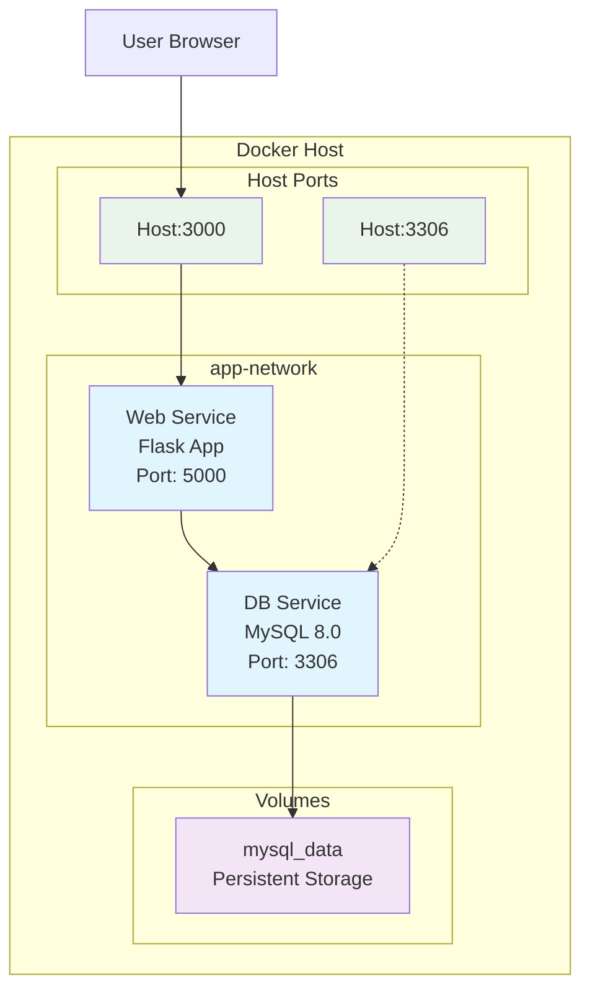
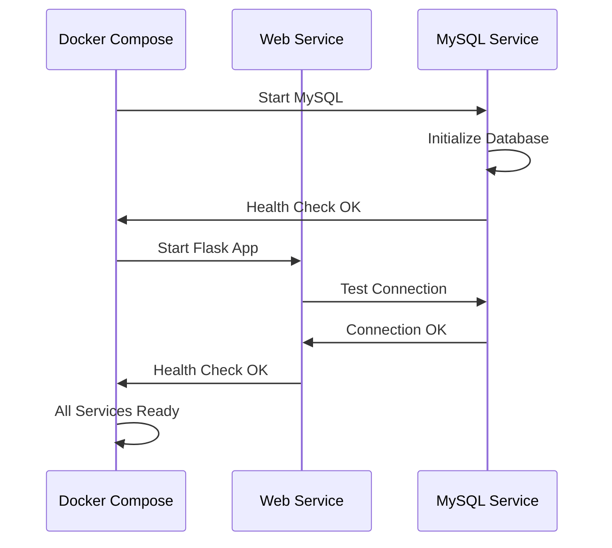

# Architecture Overview

## Service Architecture

## Data Flow

1. **User Request** → Host Port 3000
2. **Docker Network** → Web Service (Flask)
3. **Database Query** → MySQL Service
4. **Data Storage** → Persistent Volume
5. **Response** → User Browser

## Health Check Flow

## Security Boundaries

- **Network Isolation**: Services communicate via Docker network
- **Non-root User**: Web service runs as `appuser`
- **Environment Variables**: Secrets managed via `.env` file
- **Database Access**: Limited MySQL user privileges
